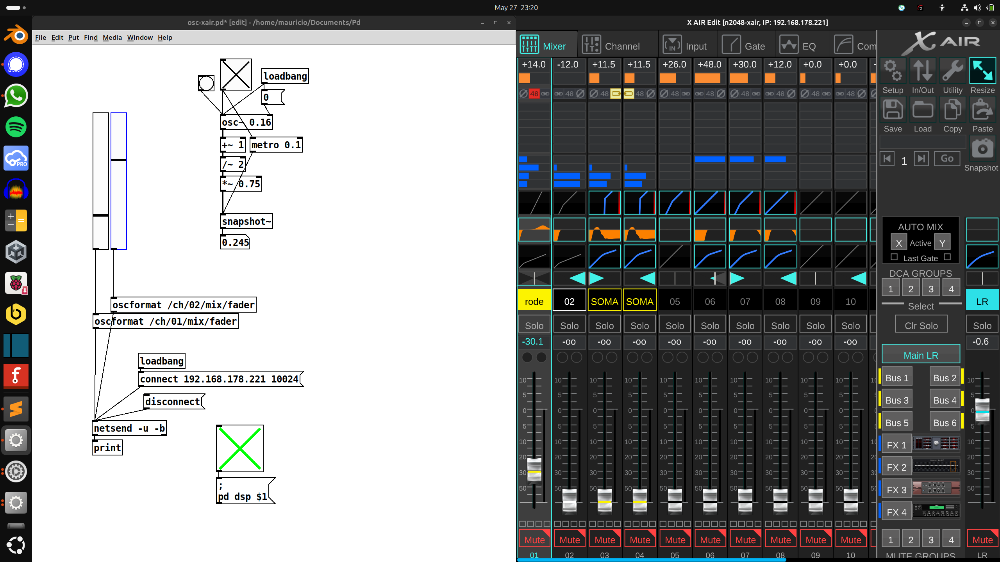

# Pure Data OSC Controller for Behringer X18

This Pure Data patch allows you to control fader levels on the Behringer X18 digital mixer via OSC over UDP.

## 🎛️ Features

- Set channel fader levels
- Easily expandable to control mute, pan, EQ, etc.
- Uses `oscx` for OSC message formatting

## 🖼️ Screenshot

